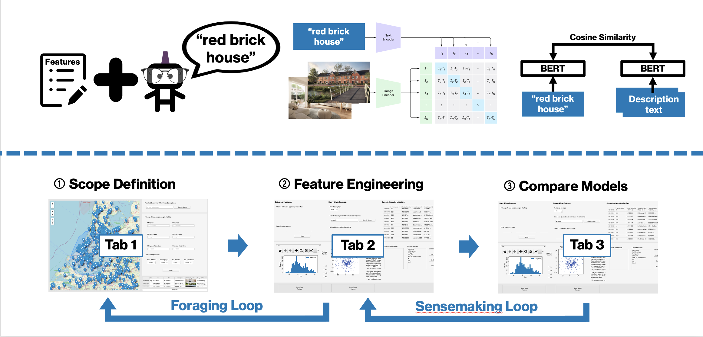

# HOME – a Heuristic Optimization for Model Engineers Dashboard

The Dutch housing market faces challenges due to a shortage of supply and high homeownership rates. Understanding this volatile market is difficult for many people, but automated models can help agents make informed decisions. The HOME system is introduced as an interactive dashboard that guides model engineers in analyzing the housing market and improving price prediction. It provides advanced analytics and a wide range of functionalities, including visualizations, feature engineering, and integration with AI tools. The dashboard allows users to explore market data and encourages further development of models and feature.

---

## Description



The workflow of our Application and GUI involves an iterative process of performance enhancement between three tabs. More specifically:

**Tab 1 - Data Scope:** This tab provides engineers with an overview of raw data distribution and features. It allows them to select a suitable data scope for their objective by applying region-based or property-based filters. The tab consists of a map showing geographical locations, a property filtering panel, and a data table that displays the selected data points resulting from the applied filters.

**Tab 2 - Feature Engineering:** In this tab, engineers can work on selecting training features. They can generate data-driven features extracted directly from the available data and free-text features through query-like prompting. The tab offers tools for understanding feature importance, including histograms, feature transformations, UMAPs, t-SNE maps, and clustering algorithms. Engineers can also explore relationships between different features using plots and assess the impact of feature transformations.

**Tab 3 - Model Comparison:** Once models are trained, engineers can proceed to this tab for model comparison. It provides metrics and a plot of validation errors for each model, allowing easy performance comparison. The tab also presents a bar chart displaying the importance of each input feature according to GXBoost. This information helps engineers identify significant features and make informed decisions to optimize model performance.

Overall, model engineers move between Tab 1 and Tab 2 in a foraging loop, adjusting data distribution, selecting data scope, and exploring feature engineering. Then, in the sensemaking loop between Tab 2 and Tab 3, they analyze information, identify patterns, normalize features, and train and evaluate models. The loops are intertwined, allowing engineers to go back and forth between stages until they achieve satisfactory results.

---

## Getting Started

### Dependencies - Prerequisites

We developed our application using `Python` and the front-end using `PyQt6`.
* We used `python 3.11`, and we suggest the user to do the same.
All the python libraries can be installed using conda as described in the next step.
* The application can be run on any OS, including windows, mac OS, and Linux.
* To install the required python libraries we use conda.
---
### Installing
1. To create a new conda environment with all the required python libraries execute in the command line in the root of the repository:

* For windows and Linux:
```
conda env create --file=environment.yml
```
* For Apple Silicon - Arm:
```
conda env create --file=environment_arm.yml
```
---
### Executing program

1. Go to the root of the repositor:
```
git clone https://github.com/vpariza/mma_2023_uva_group_1.git
```

2. Go to the root of the repository:
```
cd mma_2023_uva_group_1
```

3. Download the data from the cloud:
    1. Download the [images.zip](https://amsuni.sharepoint.com/:u:/s/STUDENT_Multimedia_Analytics___Team_1/ES2muzSPrNBNpnf6ht0_facByGQXnQQi5mpxrJoDQ0Twjg?e=ofUcdR),

    2. Download the rest of the numerical and textual data of our dataset as well as pre-computed CLIP image and BERT text features from the folder [HOME DATA](https://amsuni.sharepoint.com/:f:/s/STUDENT_Multimedia_Analytics___Team_1/EiS9y5k59p5GgF5fZaHlElsBUi0fDX4uAQE7k2KFLuRPdA?e=ahObeN),

    * You can also find the rest of the data we have at [UvA Teams Folder](https://amsuni.sharepoint.com/:f:/r/sites/STUDENT_Multimedia_Analytics___Team_1/Shared%20Documents/General/Datasets/Funda?csf=1&web=1&e=VgYzx7)

    * You can also see all the folder with all the images used and download only a selected subset of images or all the images from [UvA Teams image folder](https://amsuni.sharepoint.com/:f:/s/STUDENT_Multimedia_Analytics___Team_1/EgHMJK3u-51CkmlIiBuk5FIBHo02Zu5vLEOZDoRS8p0aPQ?e=HegleS)

4. Extract the contents of the `images.zip` into and move the rest of the data downloaded inside the folder `dataloading/data/` where the the `dataloading` folder should be in the root of the repository.


5. Activate Conda envrionment
```
conda activate mma
```

6. How to run the program
```
python3 main_window.py
```
---

### Changing Configurations
In case you want to update which data are loaded and/or from where they are loaded, as well as other changes in the visualization and code please look into the [config.ini](./config.ini) file.

## Authors

Contributors names and contact info

* [Orestis Gorgogiannis](orestis.gorgogiannis@student.uva.nl), 
* [Valentinos Pariza](valentinos.pariza@student.uva.nl),
* [Oline Ranum](oline.ranum@student.uva.nl),
* [Jona Ruthardt](jona.ruthardt@student.uva.nl),
* [Robin Sass](robin.sasse@student.uva.nl)

---

## Version History

* 0.1
    * Initial Release

---

## License

This project is licensed under the GNU GPL License - see the LICENSE file for details.

---

## Resources

* [PyQt6](https://pypi.org/project/PyQt6/)
